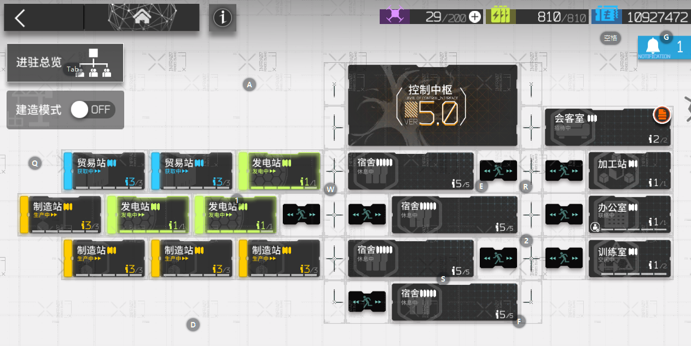

# arknights
明日方舟自动化养成
### 采用airtest 自动化测试软件进行开发
官网：http://airtest.netease.com/
采用airtest自带的图像识别进行编写流程
# 使用说明
1、本人使用雷电模拟器，可以换做其他任意模拟器或者实体机，只需保持能够采用dba的方式连接到设备即可
2、因采用图片识别，使用者需要自己调整贸易站、制造站、发电站位置，以及换班干员的皮肤或者识别图片
3、项目中包含启动雷电模拟器、明日方舟助手app、明日方舟app、登陆明日方舟以及自动输入明日方舟密码（MyFangZhuShou文件中搜索123456789）、自动领取小月卡（活动任务领取和邮件领取功能尚不完善）
## 以下为本人基建构造：
3贸易站 + 2作战记录制造站 + 2贵金属制造站 + 3发电站
布局截图如下：

如果基建布局和我的不同，可以尝试修改基建布局或者直接修改识别的图像文件，需修改关键的基建位置如下：

三个发电站的位置截图在文件myvars.py中的electric_station_group数组中
## 干员皮肤：
本人基本没有购买皮肤，所以大多数都是原皮肤或者精二皮肤
注意：阿米娅两个状态的皮肤不同
注意：此问题或许可以通过缺陷中的第三条进行优化

# 基本逻辑
采用turn.txt文件，保存了0-2三组倒班状态，读取myvars中的数组进行倒班，执行完毕后修改文件

# 功能实现状态
## 目前已实现了如下功能：

+ [x] 基建收获：信赖收获、贸易站收获、制造站收获
+ [x] 基建换班：根据myvars中的数组结构进行三班倒，主力一主力二以及备用三，三组轮流进行上班
> 倒班基建包括：
>> - [x] 贸易站
>> - [x] 制造站：电力加速用在了作战记录
>> - [x] 发电站
>> - [x] 控制中枢
>> - [x] 会客室：包含线索交流收获
>> - [x] 办公室
>>  - [x] 宿舍：宿舍对心情低的采用了加速

> 不包括：
>>  - [ ] 会客室线索交流
>>  + [x] 招募收获
>>  + [x] 访问好友
>>  + [x] 购买信用交易所打折商品
>>  + [x] 完成任务

## 未完成功能：
+ [ ] 自动刷图：目前采用了雷电模拟器商店中的明日方舟助手进行刷图，所以暂未开发
+ [ ] 定时：暂未开发
+ [ ] 信用交易所个别打折商品未加入（好像有两个，一个是代糖，另一个忘了）
+ [ ] 自动进行公开招募，已大致统计四星及以上的tag，但由于该操作执行时太过于浪费时间，并未继续开发
+ [ ] 活动任务领取尚不完善
+ [ ] 领取邮件功能偶尔会失败

## 缺陷
+ [ ] 最严重的缺陷是：明日方舟在贸易站和制造站完成任务的时候，会强制转圈，导致点击失败，有大佬帮忙想想解决办法
+ [ ] 多线程执行：本人平时培养两个小号，由于太过于消耗显卡资源，采用轮流执行的方式
+ [ ] 信用交易所不能检测剩余信用是否低于300
+ [ ] 目前图像识别采用的是整个人物的截图，如果干员刚换皮肤会导致失效
    目前想到一种优化方法是图像识别采用干员图片下的名字，但是懒得开发，需要大量截图，而且由于名字太小，预计会导致识别错误率较高，未来
    可以考虑测试一下

# 本人邮箱 hongmaoleyuan@qq.com